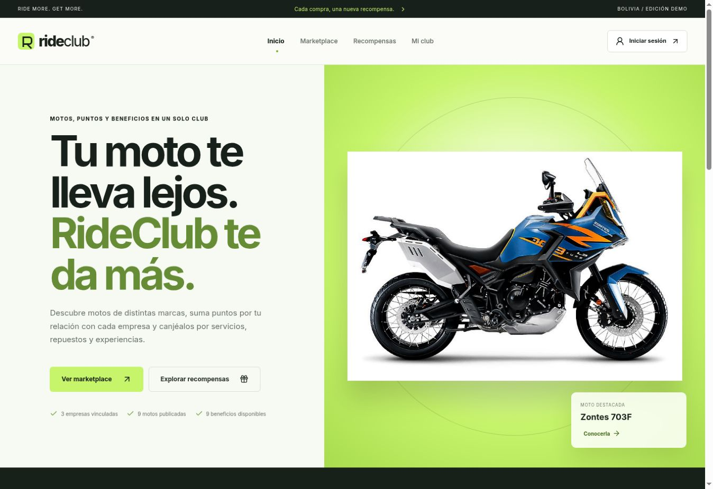
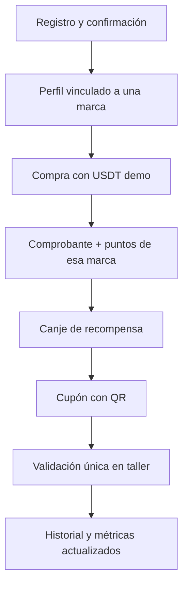
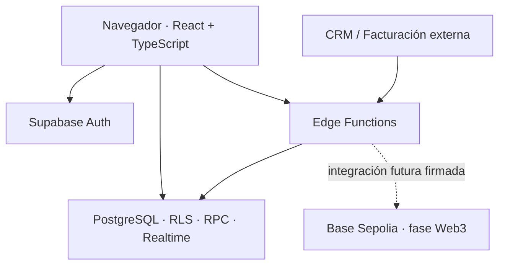
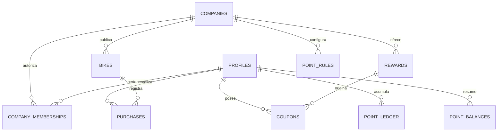
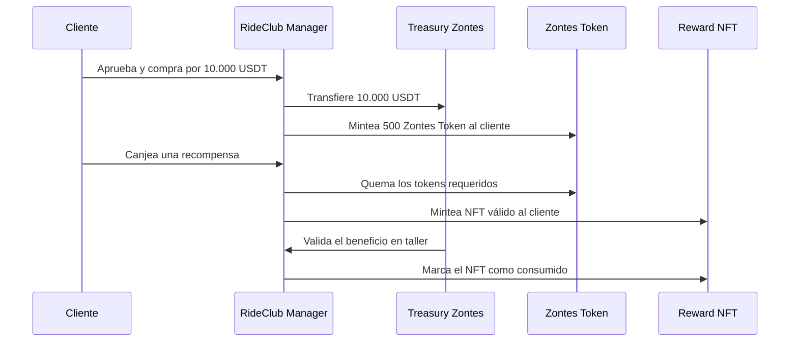

# RideClub

> **Marketplace de motocicletas y plataforma de fidelización multimarcas.**<br>
> Una sola aplicación para descubrir motos, registrar compras, acumular puntos por marca, canjear beneficios y administrar clientes, empresas y catálogos.

[](https://ride-club.vercel.app)
[](#tecnologías-y-por-qué-se-eligieron)
[](#arquitectura-técnica)
[](#blockchain-y-web3)



## Índice

1. [Explicación en un minuto](#explicación-en-un-minuto)
2. [Qué problema resuelve](#qué-problema-resuelve)
3. [Estado real del proyecto](#estado-real-del-proyecto)
4. [Usuarios y permisos](#usuarios-y-permisos)
5. [Flujo completo de la plataforma](#flujo-completo-de-la-plataforma)
6. [Tecnologías y motivos](#tecnologías-y-por-qué-se-eligieron)
7. [Arquitectura y diseño técnico](#arquitectura-técnica)
8. [Modelo de datos](#modelo-de-datos)
9. [Motor de puntos](#motor-de-puntos)
10. [Seguridad](#seguridad)
11. [Blockchain y Web3](#blockchain-y-web3)
12. [Cumplimiento de requisitos](#cumplimiento-de-requisitos)
13. [Ejecutar el proyecto](#ejecutar-el-proyecto)
14. [Desplegar desde cero](#despliegue-completo)
15. [Manual de uso operativo](#manual-de-uso-operativo)
16. [Pruebas y demostración](#pruebas-y-demostración)
17. [Respaldo y recuperación](#respaldo-y-recuperación)
18. [Preguntas técnicas frecuentes](#preguntas-técnicas-frecuentes)
19. [Estructura del repositorio](#estructura-del-repositorio)

---

## Explicación en un minuto

RideClub une tres necesidades que normalmente están separadas:

1. Un **marketplace** donde una persona descubre motos de distintas marcas.
2. Un **club de fidelización** donde cada cliente conserva puntos independientes para Zontes, NIU y Kiden.
3. Una **plataforma de administración** donde RideClub y cada empresa gestionan clientes, catálogo, recompensas, reglas, ventas y métricas.

El flujo actual funciona de extremo a extremo con un backend Supabase. Las compras y el saldo USDT se ejecutan como una **simulación controlada**, porque el prototipo no mueve fondos reales. La carpeta `contracts/` demuestra cómo la siguiente fase puede convertir ese mismo flujo en operaciones Web3: pago en USDT, emisión de tokens de la marca, quema de tokens al canjear y emisión/consumo de un NFT.

### Respuesta corta para una presentación

> “RideClub es una plataforma multimarcas de venta y fidelización de motocicletas. El cliente compra, recibe puntos separados por marca y los canjea por beneficios de un solo uso. Cada empresa administra únicamente sus clientes, motos, recompensas y métricas, mientras RideClub tiene control global. El frontend está hecho con React y TypeScript, el backend con Supabase —Auth, PostgreSQL, RLS, RPC, Realtime y Edge Functions— y el despliegue está en Vercel. La experiencia Web3 está diseñada y prototipada en Solidity para Base Sepolia, pero los fondos, tokens y NFTs reales permanecen desactivados hasta completar pruebas, auditoría y custodia segura.”

### Enlaces rápidos

- Aplicación desplegada: [https://ride-club.vercel.app](https://ride-club.vercel.app)
- Código fuente: [github.com/MateoDVE/rideclub](https://github.com/MateoDVE/rideclub)
- Verificación funcional: [docs/QA.md](docs/QA.md)
- Backend: [docs/BACKEND.md](docs/BACKEND.md)
- Operación y recuperación: [docs/OPERATIONS.md](docs/OPERATIONS.md)
- API de integración: [docs/INTEGRATION_API.md](docs/INTEGRATION_API.md)

---

## Qué problema resuelve

Las marcas pueden vender motocicletas y ofrecer servicios o promociones, pero suelen manejar ventas, clientes y fidelización en herramientas separadas. Eso causa tres problemas:

- el cliente no tiene una vista única de sus motos, puntos y beneficios;
- cada empresa necesita administrar su información sin ver datos de otras marcas;
- el operador de la plataforma necesita métricas globales y control sobre todas las empresas.

RideClub resuelve esto con un modelo **multitenant**: una plataforma compartida, pero con datos y permisos aislados por empresa.

### Propuesta de valor

| Para quién | Qué recibe |
|---|---|
| Cliente | Catálogo, favoritas, saldo USDT demo, compras, puntos por marca, referidos, historial y cupones con QR |
| Empresa | Dashboard privado, sus clientes, sus motos, sus recompensas, sus reglas, su wallet, sus ventas y validación en taller |
| RideClub | Administración global de empresas, usuarios, catálogos, actividad, ventas, canjes, wallets y reportes |

---

## Estado real del proyecto

Es importante distinguir lo que está operativo de lo que corresponde a una siguiente fase.

| Componente | Estado | Qué significa |
|---|---|---|
| Interfaz web | **Operativa** | Landing, marketplace, recompensas, Mi Club, taller y dashboards responsive |
| Backend Supabase | **Operativo** | Autenticación, base de datos, roles, RLS, RPC, Realtime, Edge Functions y auditoría |
| Despliegue Vercel | **Operativo** | Aplicación pública por HTTPS |
| Copias de seguridad | **Operativas** | Workflow diario, dump lógico, cifrado AES-256 y retención privada de 14 días |
| Compras | **Simulación funcional** | Se usa USDT demo; se generan comprobantes, puntos y métricas sin mover dinero real |
| Wallets | **Representación de prueba** | La UI permite mostrar/configurar direcciones EVM, pero no guarda claves privadas |
| Contratos Solidity | **Prototipo implementado** | Flujo de USDT, tokens y NFT modelado en `contracts/` |
| Blockchain en producción | **No activada** | Los contratos no están desplegados, auditados ni conectados al frontend |
| CRM/facturación real | **Punto de integración listo** | CSV y API segura disponibles; conectar un proveedor concreto requiere sus credenciales y mapeo |

Esta separación es una decisión de seguridad: una demostración no debe aparentar que mueve fondos reales ni custodiar claves sin auditoría.

---

## Usuarios y permisos

RideClub tiene tres roles. El rol no se decide en el navegador: se obtiene del perfil guardado en PostgreSQL y las políticas RLS vuelven a validarlo en el servidor.

| Acción | Cliente | Empresa | Admin RideClub |
|---|:---:|:---:|:---:|
| Ver landing, marketplace y recompensas públicas | Sí | Sí | Sí |
| Comprar con USDT demo | Sí | No | Mediante modo presentación |
| Ver sus puntos, compras y cupones | Propios | De sus clientes | Todos |
| Canjear una recompensa | Sí | No | Mediante modo presentación |
| Validar un cupón en taller | No | De su marca | De todas las marcas |
| Crear/editar clientes | No | Solo los de su empresa | De cualquier empresa |
| Bloquear o dar de baja clientes | No | Solo los de su empresa | Cualquiera |
| Importar clientes por CSV | No | Para su empresa | Para cualquier empresa |
| Gestionar motos, recompensas y reglas | No | Solo las propias | Todas |
| Configurar wallet de empresa | No | La propia | Todas |
| Crear, publicar o suspender empresas | No | No | Sí |
| Ver métricas y exportar CSV | Propias | De su empresa | Globales |

### Estados de una cuenta

- `active`: puede iniciar sesión y operar normalmente.
- `blocked`: suspensión reversible; no puede acceder a datos privados ni operar.
- `deleted`: baja lógica. No puede entrar, pero compras, puntos, cupones y auditoría se conservan.

La diferencia entre bloquear y dar de baja es operativa: el bloqueo está pensado para ser temporal; la baja indica que la relación terminó, sin destruir evidencia histórica.

### Estados de una empresa

- `pending`: puede prepararse, pero no aparece en el registro ni catálogo público.
- `active`: aparece públicamente, recibe clientes y puede operar.
- `suspended`: desaparece del catálogo público y pierde acceso operativo hasta reactivación.

---

## Flujo completo de la plataforma

### 1. Visitante y cliente

1. El visitante entra a **Inicio** y conoce el producto, las marcas y ofertas.
2. En **Marketplace** ve directamente las motos, con logo, color y estilo visual de cada empresa.
3. En **Recompensas** consulta beneficios y costo en puntos por marca.
4. Se registra con nombre, correo, contraseña, celular, empresa vinculada y referido opcional.
5. Supabase envía un correo de confirmación **solo para el registro inicial**.
6. Después de confirmar, los siguientes ingresos usan correo y contraseña; no se manda un correo en cada acceso.
7. La cuenta empieza con 20.000 USDT ficticios, cero puntos y un código de referido único.
8. Al comprar una moto de prueba, el sistema descuenta USDT demo, crea el comprobante y acredita puntos de esa empresa.
9. En **Mi Club** ve los puntos separados —nunca mezclados en un total ambiguo—, compras, referidos, favoritas, movimientos y cupones.
10. Al canjear, se validan saldo, cupo y vigencia en una sola operación transaccional.
11. El sistema emite un cupón con identificador y QR.
12. La empresa valida el cupón una sola vez; después queda consumido en el historial.



### 2. Administración global de RideClub

1. El administrador inicia sesión con su cuenta privilegiada.
2. Ve métricas globales y puede filtrar por empresa y período.
3. Crea una empresa, define nombre, correo, color, logo, lema, URL y estado.
4. Publica la empresa para mostrarla en la landing y habilitar registros.
5. Puede crear, editar, bloquear o dar de baja clientes de cualquier empresa.
6. Gestiona todas las motos, recompensas, reglas, wallets y cupos.
7. Revisa compras, puntos, canjes, cupones, tendencias y actividad auditada.
8. Exporta actividad en CSV.
9. Usa el **Modo presentación** para entrar visualmente como empresa o cliente demo sin necesitar correos adicionales. Ese sandbox no altera los datos reales de Supabase.

### 3. Empresa

1. Ingresa con el correo que RideClub le asignó.
2. Solo recibe datos autorizados de su empresa gracias a RLS.
3. Consulta clientes, ventas, motos vendidas, puntos y canjes propios.
4. Crea o importa clientes, los edita, bloquea o da de baja.
5. Agrega, edita o archiva motos y recompensas.
6. Define precio, puntos, cupo, vigencia y visibilidad.
7. Configura reglas para compra, referido, mantenimiento y evento.
8. Registra la dirección pública de su wallet EVM de demostración.
9. Desde **Operación y taller**, acredita una actividad o valida un cupón.

### 4. Referidos

Cada cliente recibe un código único de ocho dígitos. Un invitado puede usarlo al registrarse. La recompensa del invitador se acredita cuando el referido confirma su primera actividad válida y solo una vez. Las referencias duplicadas se rechazan por empresa.

### 5. Sincronización en tiempo real

El frontend se suscribe a cambios relevantes con Supabase Realtime. Cuando cambia una compra, regla, recompensa o cliente, se vuelve a cargar el estado autorizado sin forzar al usuario a volver a “Mi Club” ni cambiar de sección inesperadamente.

---

## Tecnologías y por qué se eligieron

| Parte | Tecnología | Para qué se usa | Por qué se eligió |
|---|---|---|---|
| Interfaz | **React 19** | Componentes, navegación, estados y dashboards | Permite construir una SPA interactiva y reutilizar componentes por rol y marca |
| Lenguaje | **TypeScript 5.9** | Tipos de cuentas, empresas, compras, puntos y cupones | Reduce errores al mantener sincronizados frontend, reglas y datos |
| Build y desarrollo | **Vite 7** | Servidor local y compilación optimizada | Inicio rápido, configuración pequeña y excelente integración con React/TS |
| Estilos | **CSS propio responsive** | Identidad visual, layouts y accesibilidad | Da control completo sobre la identidad distinta de cada marca sin depender de un kit genérico |
| Iconografía | **Lucide React** | Iconos consistentes | Es liviano, accesible y mantiene coherencia visual |
| QR | **qrcode** | Código visual de cupones | Permite demostrar la validación en taller sin depender de un proveedor externo |
| Autenticación | **Supabase Auth** | Registro, confirmación, contraseña, sesión y recuperación | Evita implementar criptografía de contraseñas manualmente y entrega sesiones seguras |
| Base de datos | **PostgreSQL en Supabase** | Datos persistentes y relaciones | Garantiza integridad, transacciones, restricciones y consultas confiables |
| Autorización | **Row Level Security** | Aislamiento por usuario y empresa | La seguridad se aplica en la base, incluso si alguien modifica el frontend |
| Lógica crítica | **Funciones PostgreSQL/RPC** | Compra, canje, acreditación, consumo y vencimiento | Ejecuta cambios relacionados de forma atómica e idempotente |
| Backend serverless | **Supabase Edge Functions / Deno** | Alta privilegiada de usuarios e integración externa | Mantiene `service_role` y secretos fuera del navegador |
| Actualizaciones | **Supabase Realtime** | Refresco de dashboards | Propaga cambios sin polling constante y conserva el contexto de navegación |
| Tareas programadas | **pg_cron** | Vencimiento diario de puntos | Automatiza reglas temporales dentro de la capa de datos |
| Hosting web | **Vercel** | Publicación del frontend | Despliegue continuo, HTTPS y CDN con configuración mínima |
| Backups | **GitHub Actions + Supabase CLI + OpenSSL** | Dump diario cifrado | Automatiza respaldo independiente y evita guardar datos abiertos en artefactos |
| Pruebas frontend | **Vitest** | Reglas de negocio y regresiones | Es rápido y comparte el ecosistema de Vite/TypeScript |
| Contratos | **Solidity + OpenZeppelin** | Token por marca, NFT y orquestación | Usa estándares auditados de ERC-20/ERC-721 como base en vez de reinventarlos |
| Toolchain Web3 | **Foundry** | Compilar y probar contratos | Es rápido, reproducible y adecuado para pruebas unitarias Solidity |
| Red prevista | **Base Sepolia** | Pruebas EVM sin fondos reales | Compatible con Ethereum y apropiada para validar el flujo antes de producción |
| Control de versiones | **Git + GitHub** | Historial, colaboración y despliegue | Deja trazabilidad de cada cambio y conecta CI/despliegues |

---

## Arquitectura técnica

RideClub usa una arquitectura de tres capas y mantiene la blockchain desacoplada hasta que sea segura para activarse.



### Capa de presentación

La SPA vive en `frontend/`. `App.tsx` coordina navegación y sesiones; los componentes presentan marketplace, recompensas, club, taller y dashboards. `styles.css` contiene el sistema visual responsive. La información de cada marca incluye logo, color y lema para no mostrar una experiencia genérica.

### Capa de aplicación

Hay dos adaptadores con la misma experiencia de usuario:

- **Modo local:** conserva un estado de demostración en el navegador. Sirve para presentación o desarrollo visual sin infraestructura.
- **Modo Supabase:** se activa al definir `VITE_SUPABASE_URL` y `VITE_SUPABASE_ANON_KEY`. Auth y PostgreSQL pasan a ser la fuente de verdad.

La selección del modo ocurre en `frontend/src/lib/supabase/client.ts`. El navegador nunca recibe `service_role`.

### Capa de datos

PostgreSQL almacena perfiles, empresas, membresías, catálogo, compras, puntos, cupones, favoritas, integraciones y auditoría. Las operaciones sensibles se ejecutan con funciones RPC:

| Función | Responsabilidad |
|---|---|
| `purchase_bike` | Valida moto/saldo, descuenta USDT demo, registra compra y acredita puntos sin duplicar una operación |
| `redeem_reward` | Valida empresa, saldo, cupo y vigencia; debita puntos y crea cupón |
| `credit_activity` | Acredita compra, referido, mantenimiento o evento con referencia única |
| `use_coupon` | Autoriza a empresa/admin y consume un cupón solo una vez |
| `fund_demo_account` | Recarga controlada del saldo ficticio |
| `expire_my_points` / `expire_all_points` | Registra vencimiento y actualiza saldos con trazabilidad |
| `manage_company` | Crea/actualiza empresas y su publicación |
| `manage_bike` / `manage_reward` | CRUD controlado del catálogo |
| `update_point_rules` | Cambia reglas por empresa |
| `update_company_wallet` | Valida y guarda la dirección pública de la empresa |
| `record_external_purchase` | Registra factura externa idempotente y acredita puntos |

### Operaciones atómicas

“Atómica” significa que una operación se completa entera o no cambia nada. Por ejemplo, un canje no puede descontar puntos sin emitir cupón. PostgreSQL bloquea las filas necesarias, valida las reglas y confirma todo dentro de una misma transacción.

### Idempotencia

Las compras y actividades usan una referencia única. Si un sistema reintenta la misma factura por un problema de red, RideClub devuelve el resultado existente en vez de cobrar o acreditar dos veces.

### Edge Functions

- `manage-user`: crea/edita usuarios desde un contexto autorizado y aplica el alcance del rol.
- `bootstrap-admin`: crea el primer administrador; después debe retirarse o protegerse con un secreto rotado.
- `integration-api`: expone una API para CRM/facturación con clave independiente, validación e idempotencia.
- `_shared/http.ts`: respuestas, CORS y utilidades comunes.

---

## Modelo de datos



### Tablas principales

| Tabla | Contenido |
|---|---|
| `companies` | Empresa, identidad, correo, estado y wallet pública |
| `profiles` | Perfil, rol, estado, marca vinculada, referido y USDT demo |
| `company_memberships` | Acceso de una cuenta empresarial a una empresa |
| `bikes` | Motos, detalles, precio, imagen, puntos y estado |
| `rewards` | Beneficios, costo, vigencia, cupo e imagen |
| `point_rules` | Reglas por tipo de evento y empresa |
| `point_ledger` | Libro inmutable de créditos y débitos de puntos |
| `point_balances` | Saldo derivado por cliente y empresa |
| `purchases` | Comprobantes y claves idempotentes |
| `coupons` | Canjes, vigencia, QR y consumo |
| `favorites` | Motos guardadas por cada cliente |
| `audit_logs` | Acciones administrativas y operativas |
| `external_customer_links` | Relación entre cliente RideClub e identificador CRM |
| `integration_logs` | Resultado técnico y `request_id` de llamadas externas |

### Por qué existen ledger y balance

`point_ledger` conserva cada causa del saldo: compra, referido, mantenimiento, evento, canje o vencimiento. `point_balances` acelera la lectura. Un trigger actualiza el saldo desde el ledger; el navegador no puede inventar un total.

---

## Motor de puntos

Los puntos se parametrizan **por empresa** y **por evento**:

- compra;
- referido;
- mantenimiento;
- asistencia a evento.

Cada regla define cantidad y días de vigencia. Cambiar, por ejemplo, el mantenimiento de Zontes de 500 a 1.000 actualiza tanto la regla como el costo del beneficio de servicio publicado, evitando valores contradictorios.

### Reglas que protege el backend

- Los puntos Zontes, NIU y Kiden se mantienen separados.
- No existe una regla genérica “Compra” desconectada de una empresa.
- Un saldo no puede quedar negativo.
- Un canje exige saldo, recompensa activa y cupo disponible.
- Una referencia repetida no vuelve a acreditar.
- Los puntos vencidos generan un movimiento de débito; no desaparecen sin registro.
- El vencimiento global se ejecuta cada día a las 04:00 UTC en la configuración actual.
- El historial se conserva aunque el cliente sea dado de baja o el producto sea archivado.

---

## Seguridad

### Autenticación

- Supabase Auth gestiona contraseñas, tokens y sesiones.
- El registro requiere confirmar el correo una vez.
- Los siguientes ingresos usan correo y contraseña.
- La recuperación envía un enlace de un solo uso para definir una nueva contraseña.
- La aplicación valida después de iniciar sesión si la cuenta sigue activa.

### Autorización

- RLS está habilitado en todas las tablas expuestas.
- Un cliente lee sus datos.
- Una empresa lee y modifica únicamente su ámbito.
- El administrador accede globalmente.
- Las funciones privilegiadas vuelven a comprobar rol, estado y empresa.
- Bloqueo, baja y suspensión se aplican en backend, no solo ocultando botones.

### Secretos

Valores públicos permitidos en el frontend:

```dotenv
VITE_SUPABASE_URL=https://TU_PROJECT_REF.supabase.co
VITE_SUPABASE_ANON_KEY=TU_PUBLISHABLE_O_ANON_KEY
```

Valores que **nunca** deben ponerse en variables `VITE_*`, Git, capturas o navegador:

- `SUPABASE_SERVICE_ROLE_KEY`
- `BOOTSTRAP_SECRET`
- `INTEGRATION_API_KEY`
- contraseña de PostgreSQL
- contraseña de cifrado de backups
- claves privadas de wallets

### Defensa adicional

- Restricciones y validaciones en PostgreSQL.
- Operaciones críticas transaccionales.
- Claves idempotentes contra doble operación.
- Bitácora de auditoría.
- Respuestas CORS controladas en Edge Functions.
- HTTPS en Vercel/Supabase.
- Cabeceras CSP, HSTS, `X-Frame-Options`, `nosniff`, política de permisos y referrer en `vercel.json`.
- Backups cifrados con AES-256-CBC y PBKDF2.

---

## Blockchain y Web3

### Por qué se utilizaría blockchain

Blockchain no se usa solo “para guardar puntos”. Su valor aparece cuando varias empresas y clientes necesitan verificar activos digitales sin depender únicamente de una pantalla de RideClub:

- el pago en USDT queda verificable;
- cada marca emite su propio token de fidelización;
- el cliente puede comprobar que recibió tokens;
- el canje destruye los tokens usados;
- el beneficio se representa como NFT único;
- la empresa puede verificar y consumir ese NFT;
- los eventos del contrato permiten auditar el ciclo completo.

La base de datos seguirá siendo útil para perfiles, búsqueda, métricas, permisos y una experiencia rápida. La cadena funcionaría como capa verificable de propiedad y liquidación; no reemplaza todo el backend.

### Flujo Web3 previsto

Ejemplo: una persona tiene 20.000 USDT y compra una moto Zontes de 10.000 USDT.



### Contratos incluidos

| Contrato | Función |
|---|---|
| `MockUSDT.sol` | Token de prueba con 6 decimales; no es USDT real |
| `BrandLoyaltyToken.sol` | ERC-20 con 0 decimales, no transferible y distinto por marca |
| `RewardNFT.sol` | ERC-721 no transferible con estado válido/consumido |
| `RideClubManager.sol` | Registra empresas y ofertas; cobra USDT, mintea/quema tokens y crea/consume NFTs |

Los tokens y NFTs son no transferibles para que representen fidelidad y derechos de canje, no instrumentos de especulación.

### Wallets

El diseño previsto crea o vincula una dirección EVM para el cliente. En esta entrega la dirección mostrada es de demostración y no se almacena ninguna clave privada. En una implementación real se debe elegir una estrategia explícita:

- wallet embebida con recuperación;
- wallet externa conectada por el usuario;
- custodia institucional.

La wallet operadora de RideClub tendría permisos de minteo y configuración. En producción no debe ser una cuenta personal: debe ser una **multisig**, con separación de responsabilidades, límites, pausa de emergencia y registro de firmantes.

### Qué falta antes de usar fondos reales

1. Pruebas unitarias y de integración de contratos.
2. Scripts reproducibles de despliegue.
3. Auditoría de seguridad externa.
4. Multisig para la cuenta operadora.
5. Pausa de emergencia y plan de actualización.
6. Elección e integración segura del proveedor de wallet.
7. Indexador de eventos y reconciliación con PostgreSQL.
8. Gestión de metadata del NFT.
9. Manejo de confirmaciones, reintentos y fallos de red.
10. Revisión legal/contable del uso de USDT y activos digitales.

Por eso el frontend rotula actualmente **USDT demo** y **quema simulada**. El diseño blockchain existe, pero no se afirma que haya activos reales.

---

## Cumplimiento de requisitos

### Requisitos funcionales esenciales

Todos los requisitos funcionales del documento están cubiertos en el alcance del MVP. La columna “Evidencia” indica dónde puede comprobarse.

| Requisito solicitado | Estado | Cómo se cumple | Evidencia |
|---|---|---|---|
| Registro y autenticación | **Cumplido** | Alta con datos personales, marca y contraseña; confirmación inicial, login y recuperación con Supabase Auth | Registro, `api.ts`, Supabase Auth |
| Perfiles vinculados a una marca | **Cumplido** | Cada cliente conserva una empresa vinculada y puede operar dentro de sus reglas | `profiles`, registro, Mi Club |
| Sincronización con base de clientes existente | **Cumplido en el alcance disponible** | Importación CSV y API genérica segura para crear/sincronizar clientes; el organizador no entregó un CRM específico | Dashboard, `integration-api`, [INTEGRATION_API.md](docs/INTEGRATION_API.md) |
| Roles cliente / administrador | **Cumplido y ampliado** | Roles `client`, `company` y `admin`, con alcance aplicado por RLS | `profiles`, `company_memberships`, políticas RLS |
| Puntos por compra | **Cumplido** | Regla propia de cada empresa, acreditada al confirmar compra | `purchase_bike`, ledger, dashboard |
| Puntos por referido | **Cumplido** | Código de 8 dígitos y acreditación única tras actividad válida | Registro, `my_referrals`, pruebas |
| Puntos por mantenimiento | **Cumplido** | Empresa/admin registra actividad con referencia única y consentimiento | Taller, `credit_activity` |
| Puntos por asistencia a eventos | **Cumplido** | Tipo de actividad parametrizable en las reglas | Dashboard, `point_rules` |
| Saldo en tiempo real | **Cumplido** | Balance derivado del ledger y refresco mediante Realtime | `point_balances`, trigger, suscripción |
| Historial de puntos | **Cumplido** | Cada crédito, débito, canje y vencimiento se conserva | `point_ledger`, Mi Club |
| Vencimiento configurable | **Cumplido** | Días por regla y tarea programada diaria | `point_rules`, `pg_cron` |
| Catálogo independiente por marca | **Cumplido** | Motos y recompensas pertenecen a una empresa y muestran su identidad | Marketplace, Recompensas, `bikes`, `rewards` |
| Validación de disponibilidad y saldo | **Cumplido** | El canje comprueba estado, cupo, saldo y vigencia en el servidor | `redeem_reward` |
| Comprobantes/cupones digitales | **Cumplido** | Comprobante de compra y cupón con QR e identificador | Mi Club, modal de cupón |
| Trazabilidad de canjes | **Cumplido** | Emisión, vigencia, uso y auditoría permanecen en historial | `coupons`, `audit_logs` |
| CRUD de usuarios | **Cumplido** | Admin global y empresa según alcance; alta, edición, bloqueo y baja lógica | Dashboard, `manage-user` |
| CRUD de reglas | **Cumplido** | Configuración por empresa de puntos y vencimiento | Dashboard, `update_point_rules` |
| Reportes en tiempo real | **Cumplido** | Métricas de clientes, actividad, compras, ventas, motos, puntos y canjes | Dashboards, Realtime |
| Tendencias | **Cumplido** | Visualización de registros, ventas y canjes de los últimos 14 días | Dashboard |
| Exportación de datos | **Cumplido** | Exportación CSV protegida y sanitizada | Botón exportar, `exportCSV` |
| Contenido por marca | **Cumplido** | Logo, color, lema, motos, recompensas, reglas y wallet | Landing, marketplace, dashboard |
| Interfaz responsive | **Cumplido** | Escritorio y móvil, grillas y navegación adaptables | `styles.css`, capturas móviles |
| Identidad visual diferenciada | **Cumplido** | Contexto visual, logo y color de cada empresa en catálogo y recompensas | Componentes de marca |
| Navegación accesible | **Cumplido** | Enlace para saltar contenido, teclado, foco, etiquetas ARIA y reducción de movimiento | UI y [QA.md](docs/QA.md) |

#### Evidencia visual

[Registro y marca](docs/preview-registration.jpg) ·
[Marketplace móvil](docs/preview-mobile.jpg) ·
[Mi Club](docs/preview-club.jpg) ·
[Recompensas](docs/preview-rewards.jpg) ·
[Compra](docs/preview-checkout.jpg) ·
[Cupón](docs/preview-benefit.jpg) ·
[Club móvil](docs/preview-mobile-club.jpg)

### Requisitos no funcionales

| Requisito | Estado | Implementación |
|---|---|---|
| Seguridad | **Cumplido** | Supabase Auth, RLS, funciones privilegiadas, secretos de servidor, HTTPS, CSP, auditoría e idempotencia |
| Escalabilidad | **Cumplido** | Modelo multitenant; una empresa nueva usa las mismas tablas, permisos y dashboard sin duplicar la aplicación |
| Integración | **Cumplido** | Edge Function con API HTTPS, clave independiente, clientes, catálogo, compras e idempotencia; importación CSV como alternativa |
| Disponibilidad | **Cumplido operativamente** | Hosting administrado en Vercel/Supabase y backup lógico diario cifrado con GitHub Actions |
| Mantenibilidad | **Cumplido** | TypeScript, estructura modular, migraciones, pruebas, Git/GitHub y documentación técnica/operativa |

#### Aclaración sobre disponibilidad

El workflow de backup ya genera artefactos cifrados. Para convertir los objetivos sugeridos de recuperación —RPO de 24 horas y RTO menor a 4 horas— en una garantía medible, debe ejecutarse periódicamente un simulacro de restauración en un proyecto Supabase separado. Eso es una práctica operativa continua, no una función visible de la web.

### Entregables

| Entregable | Ubicación |
|---|---|
| Prototipo funcional | [ride-club.vercel.app](https://ride-club.vercel.app) |
| Código fuente compartido | Este repositorio GitHub |
| Arquitectura y diseño técnico | Este README y [docs/ARCHITECTURE.md](docs/ARCHITECTURE.md) |
| Núcleo de usuarios y puntos | `frontend/` + `supabase/` |
| Manual de despliegue y administración | Secciones siguientes + [docs/OPERATIONS.md](docs/OPERATIONS.md) |
| Diseño/prototipo blockchain | `contracts/` |

---

## Ejecutar el proyecto

### Opción A: interfaz local rápida

Úsala para revisar diseño o presentar sin depender de Supabase.

Requisitos:

- Node.js 22.12 o superior;
- npm;
- Git.

```bash
git clone https://github.com/MateoDVE/rideclub
cd RideClub/frontend
npm ci
npm run dev
```

Abre la URL mostrada por Vite, normalmente `http://localhost:5173`.

Sin variables de Supabase, la aplicación activa automáticamente la demo local. Puedes entrar como cliente demo o administrador demo desde la interfaz. Los cambios se guardan solo en el navegador.

### Opción B: frontend conectado al Supabase remoto

```bash
git clone https://github.com/MateoDVE/rideclub
cd RideClub/frontend
cp .env.example .env.local
```

Edita `frontend/.env.local`:

```dotenv
VITE_SUPABASE_URL=https://TU_PROJECT_REF.supabase.co
VITE_SUPABASE_ANON_KEY=TU_PUBLISHABLE_O_ANON_KEY
```

Luego:

```bash
npm ci
npm run dev
```

La URL y la clave pública se obtienen en **Supabase → Project Settings → API**. La clave `anon`/publishable está diseñada para el navegador porque RLS protege los datos; la `service_role` no lo está.

### Opción C: stack Supabase local completo

Requisitos adicionales:

- Docker Desktop activo;
- Supabase CLI, que puede ejecutarse mediante `npx`.

Desde la raíz:

```bash
npx supabase start
npx supabase db reset
npx supabase status
```

`supabase status` muestra la URL local y la anon key. Crea `frontend/.env.local`:

```dotenv
VITE_SUPABASE_URL=http://127.0.0.1:54321
VITE_SUPABASE_ANON_KEY=PEGA_LA_ANON_KEY_LOCAL
```

Crea `supabase/.env.local`, que está ignorado por Git:

```dotenv
BOOTSTRAP_SECRET=UN_SECRETO_LOCAL_LARGO
INTEGRATION_API_KEY=OTRO_SECRETO_LOCAL_LARGO
```

Levanta funciones en otra terminal:

```bash
npx supabase functions serve --env-file supabase/.env.local
```

Y el frontend:

```bash
cd frontend
npm ci
npm run dev
```

Los correos locales aparecen en Inbucket, normalmente `http://127.0.0.1:54324`.

---

## Despliegue completo

### 1. Crear y preparar Supabase

1. Crea un proyecto en [Supabase](https://supabase.com).
2. Conserva de forma segura la contraseña de la base.
3. Instala o usa la CLI con `npx`.
4. Desde la raíz del repositorio ejecuta:

```bash
npx supabase login
npx supabase link --project-ref TU_PROJECT_REF
npx supabase db push
```

`TU_PROJECT_REF` es el identificador que aparece en **Supabase → Project Settings → General → Reference ID** y también en la URL `https://TU_PROJECT_REF.supabase.co`.

### 2. Configurar secretos y Edge Functions

Genera y guarda valores distintos en un gestor de contraseñas; luego configúralos:

```bash
npx supabase secrets set \
  BOOTSTRAP_SECRET=TU_SECRETO_LARGO_DE_BOOTSTRAP \
  INTEGRATION_API_KEY=TU_CLAVE_LARGA_DE_INTEGRACION
```

Puedes generar cada valor con `openssl rand -hex 32`. No publiques la salida ni la pegues en este repositorio.

Despliega las funciones:

```bash
npx supabase functions deploy manage-user
npx supabase functions deploy bootstrap-admin --no-verify-jwt
npx supabase functions deploy integration-api --no-verify-jwt
```

`bootstrap-admin` e `integration-api` desactivan la validación JWT de plataforma porque validan su propio secreto. Eso no significa que sean públicas sin protección.

### 3. Crear el primer administrador

Usa una dirección de correo que controles:

```bash
curl -i "https://TU_PROJECT_REF.supabase.co/functions/v1/bootstrap-admin" \
  -H "Content-Type: application/json" \
  -H "Authorization: Bearer TU_ANON_KEY" \
  -H "x-bootstrap-secret: TU_BOOTSTRAP_SECRET" \
  -d '{"email":"admin@ejemplo.com","fullName":"Administración RideClub"}'
```

Después:

1. usa **Olvidé o todavía no tengo contraseña** en el login;
2. abre el correo de recuperación;
3. define una contraseña;
4. ingresa y comprueba que la navegación muestre **Administración**;
5. rota `BOOTSTRAP_SECRET` o elimina la función remota si ya no se necesita.

### 4. Configurar autenticación

En **Supabase → Authentication → URL Configuration**:

- `Site URL`: la URL pública, por ejemplo `https://ride-club.vercel.app`;
- Redirect URL de autenticación: `https://TU_DOMINIO/?auth=callback`;
- Redirect URL de recuperación: `https://TU_DOMINIO/?auth=recovery`;
- durante desarrollo, agrega también `http://localhost:5173/**`.

En **Authentication → Providers → Email** conserva habilitado el proveedor y la confirmación de correo si se desea validar el primer registro.

### 5. Desplegar frontend en Vercel

1. Importa el repositorio en Vercel.
2. Selecciona Vite como framework.
3. Configura **Root Directory** como `frontend`.
4. Usa:
   - Install Command: `npm ci`
   - Build Command: `npm run build`
   - Output Directory: `dist`
5. Agrega para Production y Preview:

```dotenv
VITE_SUPABASE_URL=https://TU_PROJECT_REF.supabase.co
VITE_SUPABASE_ANON_KEY=TU_PUBLISHABLE_O_ANON_KEY
```

6. Despliega.
7. Copia la URL final a la configuración de Auth de Supabase.
8. Prueba registro, callback y recuperación desde una ventana privada.

Si se despliega desde la raíz del repositorio en otra plataforma, deben adaptarse los comandos a `cd frontend && npm ci` y `cd frontend && npm run build`.

### 6. Configurar la API de CRM/facturación

URL base:

```text
https://TU_PROJECT_REF.supabase.co/functions/v1/integration-api
```

Todas las llamadas usan:

```text
x-integration-key: TU_INTEGRATION_API_KEY
```

Rutas disponibles:

| Método | Ruta | Uso |
|---|---|---|
| GET | `/health` | Salud del servicio |
| GET | `/customers?company=zontes` | Clientes sincronizados |
| POST | `/customers` | Crear o actualizar cliente externo |
| GET | `/bikes?company=zontes` | Catálogo de la empresa |
| GET | `/purchases?company=zontes` | Compras registradas |
| POST | `/purchases` | Registrar factura externa y acreditar puntos |

Consulta payloads completos en [docs/INTEGRATION_API.md](docs/INTEGRATION_API.md).

---

## Manual de uso operativo

### Alta de una empresa

1. Inicia como administrador.
2. Abre **Empresas**.
3. Selecciona crear empresa.
4. Completa identidad, correo de acceso, URL y estado.
5. Déjala `pending` mientras se carga contenido.
6. Agrega motos, recompensas y reglas.
7. Revisa su dashboard mediante Modo presentación.
8. Cámbiala a `active` para publicarla.
9. La empresa puede usar recuperación de contraseña con el correo asignado para establecer su acceso.

### Alta de clientes

Hay cuatro vías:

- registro público del propio cliente;
- creación manual por su empresa;
- creación global por el administrador;
- importación CSV o API externa.

El administrador **no pierde** ninguna capacidad: puede operar todas las empresas. La cuenta empresarial tiene el mismo formulario, limitado a su ámbito.

### Importación CSV

La importación acepta archivos de clientes, muestra una vista previa y reporta filas inválidas o duplicadas. Una empresa importa a su empresa actual; el admin debe indicar empresa cuando la importación es global.

Antes de confirmar:

1. revisa encabezados y separador;
2. valida correo, nombre y teléfono;
3. comprueba la empresa de destino;
4. corrige duplicados indicados en la vista previa;
5. importa y revisa el resumen.

### Gestión de catálogo

- **Agregar:** crea una moto o recompensa para la empresa elegida.
- **Editar:** cambia nombre, precio, puntos, descripción, cupo, vigencia o imagen.
- **Archivar:** retira el elemento del catálogo sin borrar el historial.
- **Publicar:** permite que un elemento activo aparezca a clientes.

### Gestión de puntos

1. Abre reglas de la empresa.
2. Cambia puntos y vigencia del evento.
3. Guarda.
4. Revisa Recompensas y confirma la sincronización del mantenimiento.
5. Realiza una actividad de prueba y comprueba el ledger.

Cambiar una regla no reescribe operaciones antiguas. Las nuevas operaciones usan el valor vigente y el historial conserva el valor aplicado en su momento.

### Acreditar una actividad

En **Operación y taller** se seleccionan cliente, empresa y tipo de evento. La referencia —por ejemplo una factura, orden de servicio o entrada— prueba por qué se acreditaron puntos y evita duplicados. “Factura” no significa que RideClub emita una factura fiscal; es el identificador entregado por el sistema comercial.

### Validar un canje

1. El cliente abre su cupón y muestra el QR/código.
2. La empresa abre Taller.
3. Busca o escanea el identificador.
4. Comprueba cliente, marca, beneficio, estado y vigencia.
5. Confirma el consumo.
6. El cupón pasa a utilizado.
7. Un segundo intento es rechazado.

### Bloquear, reactivar o dar de baja

- Bloquea ante una incidencia temporal.
- Reactiva cuando se resuelva.
- Da de baja si la cuenta deja de operar.
- No borres manualmente filas de historial.

### Supervisión diaria

- comprueba que la aplicación pública responda;
- revisa errores en Supabase Logs;
- comprueba Edge Functions y errores de autenticación;
- revisa el último backup exitoso en GitHub Actions;
- investiga referencias duplicadas o integraciones `4xx/5xx`;
- no compartas secretos en chats o capturas.

---

## Pruebas y demostración

### Comprobaciones automáticas

Frontend:

```bash
cd frontend
npm ci
npm test
npm run build
```

Base local:

```bash
npx supabase start
npx supabase db reset
npx supabase test db
```

Contratos, cuando Foundry esté instalado:

```bash
cd contracts
forge install OpenZeppelin/openzeppelin-contracts --no-commit
forge build
```

Compilar contratos no equivale a auditarlos ni desplegarlos.

### Recorrido recomendado para presentar

Este recorrido muestra el valor completo en pocos minutos:

1. **Inicio:** explica problema, propuesta y marcas.
2. **Marketplace:** muestra directamente las motos y cambia entre Zontes, NIU y Kiden para enseñar su identidad.
3. **Administrador:** entra al panel global y enseña métricas y empresas.
4. **Modo presentación → Zontes:** demuestra que la empresa solo ve lo suyo.
5. **Modo presentación → Cliente demo:** abre Mi Club y señala USDT demo, puntos separados y wallet.
6. **Compra:** compra una moto de precio público y muestra comprobante/puntos.
7. **Canje:** elige una recompensa, confirma y muestra el QR.
8. **Taller:** regresa a la empresa y consume el cupón.
9. **Segundo intento:** demuestra que el cupón ya no es válido.
10. **Regla:** cambia mantenimiento y comprueba que el beneficio relacionado se sincroniza.
11. **Requisito técnico:** enseña RLS, el ledger y la API desde este README.
12. **Blockchain:** explica el diagrama y aclara que está prototipado, no desplegado con fondos reales.

### Prueba de autenticación real

1. Registra un correo nuevo.
2. Confirma el correo una sola vez.
3. Cierra sesión.
4. Vuelve a entrar con contraseña y confirma que no envía otro correo.
5. Abre Marketplace, espera una actualización de datos y comprueba que conserva la página actual.
6. Bloquea la cuenta desde admin e intenta ingresar de nuevo.
7. Reactívala y confirma el acceso.

### Prueba de aislamiento empresarial

1. Crea dos clientes en empresas distintas.
2. Entra como una empresa.
3. Confirma que solo ve su cliente, catálogo y métricas.
4. Intenta operar un identificador de la otra empresa.
5. Verifica que el backend lo rechace.

### Prueba de API e idempotencia

```bash
curl -sS \
  "https://TU_PROJECT_REF.supabase.co/functions/v1/integration-api/health" \
  -H "x-integration-key: TU_INTEGRATION_API_KEY"
```

Después registra una compra externa, repite exactamente la misma referencia y confirma que compras y puntos no aumentan por segunda vez.

---

## Respaldo y recuperación

El archivo `.github/workflows/database-backup.yml` se ejecuta diariamente a las 08:00 UTC. El proceso:

1. enlaza el proyecto Supabase;
2. exporta esquema y datos;
3. comprime ambos dumps;
4. cifra el archivo con AES-256-CBC y PBKDF2;
5. elimina los archivos sin cifrar;
6. sube un artefacto privado con retención de 14 días.

### Secrets requeridos en GitHub Actions

- `SUPABASE_ACCESS_TOKEN`
- `SUPABASE_DB_PASSWORD`
- `SUPABASE_PROJECT_REF`
- `BACKUP_ENCRYPTION_PASSWORD`

Configúralos en **GitHub → Settings → Secrets and variables → Actions**. Después abre **Actions → Encrypted database backup → Run workflow** y confirma que el job termina en verde y crea `rideclub-database-backup-*`.

### Backup manual

Requiere Docker Desktop activo:

```bash
mkdir -p "$HOME/RideClub-backups"
BACKUP_DATE=$(date +%Y-%m-%d_%H-%M)

npx supabase db dump --linked \
  --file "$HOME/RideClub-backups/schema-$BACKUP_DATE.sql"

npx supabase db dump --linked \
  --data-only \
  --file "$HOME/RideClub-backups/data-$BACKUP_DATE.sql"
```

### Descifrar un artefacto

```bash
openssl enc -d -aes-256-cbc -pbkdf2 \
  -in rideclub-FECHA.tar.gz.enc \
  -out rideclub-FECHA.tar.gz

tar -xzf rideclub-FECHA.tar.gz
```

### Simulacro de recuperación

Nunca pruebes una restauración directamente sobre producción.

1. Crea un proyecto Supabase temporal.
2. Descifra un backup reciente.
3. Restaura primero esquema y después datos.
4. Verifica conteos de empresas, perfiles, compras, ledger y cupones.
5. Prueba una sesión de cada rol.
6. Registra fecha, responsable, resultado y duración.
7. Elimina el proyecto temporal y los dumps abiertos de forma segura.

---

## Preguntas técnicas frecuentes

### ¿Por qué Supabase y no un backend hecho completamente desde cero?

Porque el proyecto necesita autenticación, PostgreSQL, autorización por fila, funciones, tiempo real y tareas programadas. Supabase reúne esas capacidades sobre tecnologías estándar y permite dedicar el tiempo a las reglas del negocio. La lógica crítica sigue estando en SQL/RPC y Edge Functions, no escondida en el frontend.

### ¿La anon key expuesta es un problema?

No. La clave pública identifica el proyecto y está pensada para el navegador. La protección real la aplican la sesión y RLS. La `service_role`, en cambio, omite RLS y nunca se expone.

### ¿Cómo se evita que una empresa vea datos de otra?

`company_memberships` relaciona la cuenta con su empresa y `has_company_access` se usa en políticas RLS. Aunque alguien altere JavaScript o llame directamente a la API, PostgreSQL filtra o rechaza la operación.

### ¿Cómo se evita un doble cobro o doble puntaje?

Cada operación usa una clave única, restricciones de base y funciones transaccionales. Un reintento devuelve el resultado existente; una referencia reutilizada con datos diferentes se rechaza.

### ¿Por qué los puntos no son una columna editable?

Porque un saldo sin historia no se puede auditar. RideClub usa un ledger de movimientos y deriva el balance mediante trigger. Eso permite explicar cada punto y registrar vencimientos/canjes.

### ¿Qué pasa si cambia una regla?

Solo afecta operaciones futuras. El ledger conserva la cantidad histórica aplicada. La regla de mantenimiento también sincroniza el costo del beneficio relacionado para que la landing no muestre un valor anterior.

### ¿Qué significa “tiempo real” aquí?

Los dashboards se suscriben a cambios de tablas con Supabase Realtime. Cuando ocurre un cambio autorizado, el frontend actualiza sus datos sin esperar un refresco manual y sin cambiar arbitrariamente de página.

### ¿Se usa blockchain actualmente?

Existe el diseño técnico y un prototipo de contratos, pero la aplicación desplegada no mueve USDT real ni mintea activos. El flujo visible es un mock funcional seguro. Blockchain es la siguiente fase y requiere auditoría, custodia y conexión de wallets.

### ¿Por qué usar blockchain si ya existe PostgreSQL?

PostgreSQL es mejor para perfiles, búsquedas, permisos y métricas. Blockchain agrega verificabilidad compartida para pagos y activos digitales. El diseño es híbrido: cada tecnología se usa donde aporta valor.

### ¿Quién mintea tokens?

El `RideClubManager`, autorizado por el token de cada marca. En producción el control administrativo debe pertenecer a una multisig de RideClub, no a una wallet individual.

### ¿Qué ocurre al canjear?

En el MVP se debitan puntos y se crea un cupón. En la fase Web3 se quemarían tokens de la marca y se mintearía un NFT válido. Al entregar el beneficio, la empresa lo marcaría consumido.

### ¿El QR es seguridad criptográfica?

Actualmente es un identificador práctico para buscar el cupón. La seguridad la aplica el backend al comprobar propietario, empresa, vigencia y uso. En Web3 se puede agregar firma del titular o lectura del estado on-chain.

### ¿Cómo se conecta un CRM real?

El proveedor llama a `integration-api` con su clave y un identificador externo. La API sincroniza clientes y compras. Como no se entregó un CRM concreto, el último paso es mapear sus campos y autenticación; el contrato de RideClub ya está implementado.

### ¿Cómo se agrega una cuarta empresa?

El admin la crea, carga identidad, reglas y catálogo, asigna un correo y la publica. No hace falta duplicar páginas ni tablas: el dashboard y RLS se parametrizan por `company_id`.

### ¿Qué pasa si se elimina una moto o cliente con historial?

Se usa archivado o baja lógica. Los comprobantes, movimientos y cupones permanecen para trazabilidad.

### ¿Cómo se recupera el sistema ante un problema?

El frontend se puede volver a desplegar desde GitHub. La base se recupera desde el último dump cifrado. El procedimiento debe ensayarse en un proyecto separado y documentar RPO/RTO reales.

---

## Estructura del repositorio

```text
RideClub/
├── frontend/
│   ├── public/assets/            # Logos, fotos y tipografía local
│   ├── src/components/           # Landing, marketplace, club, taller y dashboards
│   ├── src/data/catalog.ts       # Catálogo inicial y datos visuales
│   ├── src/lib/demo.ts           # Dominio y modo local de presentación
│   ├── src/lib/business.ts       # Permisos y gestión empresarial
│   ├── src/lib/clientCsv.ts      # Importación y validación CSV
│   ├── src/lib/phone.ts          # Regiones y normalización de celular
│   ├── src/lib/supabase/         # Cliente y adaptador del backend
│   ├── src/App.tsx               # Navegación y coordinación principal
│   └── src/styles.css            # Sistema visual responsive
├── supabase/
│   ├── migrations/               # Esquema, RLS, RPC, Realtime, cron e integración
│   ├── functions/                # Edge Functions y utilidades compartidas
│   ├── tests/database.test.sql   # Pruebas de permisos y operaciones
│   ├── seed.sql                  # Datos iniciales reproducibles
│   └── config.toml               # Configuración local de Supabase
├── contracts/
│   ├── src/                      # MockUSDT, token de marca, NFT y manager
│   ├── foundry.toml              # Configuración Foundry
│   └── README.md                 # Alcance y precauciones Web3
├── docs/                         # Arquitectura, API, operación, QA, fuentes y capturas
├── .github/workflows/            # Backup automatizado cifrado
├── vercel.json                   # SPA y cabeceras de seguridad
└── README.md                     # Documento principal
```

### Migraciones

Las migraciones se aplican en orden y constituyen el historial del esquema:

1. tablas y restricciones;
2. RLS y helpers de autorización;
3. registro/perfiles;
4. RPC de compra, canje, taller y vencimiento;
5. administración de empresas y catálogo;
6. Realtime;
7. protección adicional de saldos;
8. vencimiento programado;
9. API de integración.

En producción se agrega una migración nueva; no se modifica una migración ya aplicada.

---

## Fuentes, alcance comercial y licencia de uso

Los modelos y referencias visuales se basan en catálogos públicos consultados para la demostración. Zontes y NIU usan referencias de Bolivia; Kiden usa MotoFun Argentina y el catálogo oficial internacional. La disponibilidad de Kiden en Bolivia no está confirmada. Los beneficios, reglas, cupos y vigencias son propuestas de hackathon y requieren aprobación comercial.

Consulta [docs/SOURCES.md](docs/SOURCES.md) para las fuentes y atribuciones. Las marcas, logos y fotografías pertenecen a sus respectivos titulares; este prototipo no implica afiliación o aprobación comercial.

---

## Checklist antes de una presentación

- [ ] La URL pública abre por HTTPS.
- [ ] El administrador puede iniciar sesión.
- [ ] Zontes, NIU y Kiden aparecen activas.
- [ ] Hay al menos un cliente activo para Modo presentación.
- [ ] Marketplace muestra motos y logos.
- [ ] Los puntos aparecen separados por marca.
- [ ] Una compra demo genera comprobante y puntos.
- [ ] Un canje genera QR y el segundo consumo se rechaza.
- [ ] La empresa solo ve su ámbito.
- [ ] Cambiar mantenimiento actualiza el beneficio relacionado.
- [ ] La exportación CSV descarga correctamente.
- [ ] El último backup de GitHub Actions está en verde.
- [ ] El equipo sabe explicar que blockchain está prototipada, no activada con fondos reales.
- [ ] Nadie muestra secretos, claves privadas o contraseñas durante la demo.

Con este recorrido, la matriz de requisitos y las respuestas técnicas anteriores, una persona nueva puede entender, ejecutar, desplegar, operar y defender el proyecto sin depender de conocimiento previo de la implementación.
